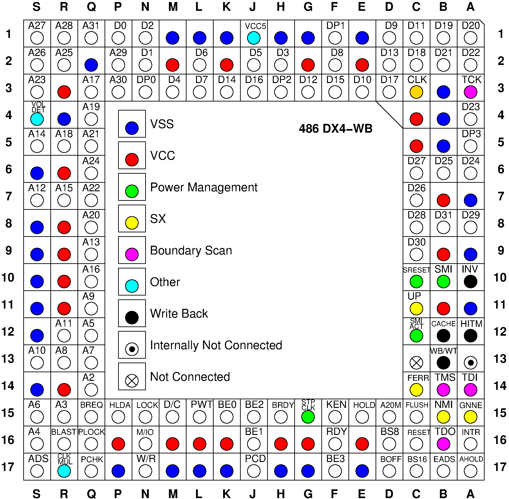

# 486 CPU Socket Pinout
An open-source figure of the pinout of the 486 DX4 CPU socket. These usually plug in to Socket 3 PGA sockets.

# Features / Comments
- The figure is made in xfig https://sourceforge.net/projects/mcj/ and is in vector graphics.
- You can export the fig image to all sorts of formats.
- When exporting to a raster format, like png, please use magnification. For good results use at least 400%.

